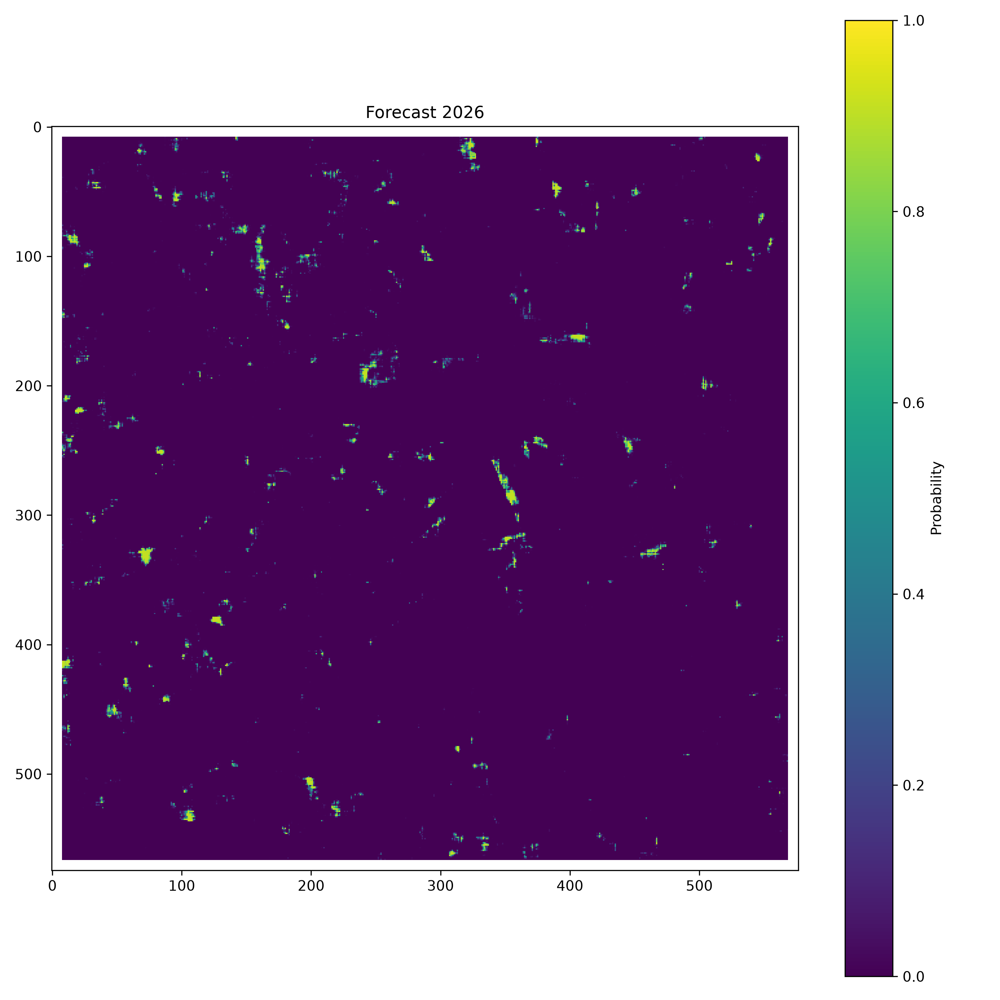

# Redes Convolucionales Profundas en Predicción de Deforestación en Colombia

## Integrantes 
- Luis Andrés Rodríguez Florián (lurodriguezf@unal.edu.co)  
- Angel David Gomez Pastrana(angomezp@unal.edu.co)

----

## Descripción
Proyecto de machine learning basado en (Ball et al., 2022, Using deep convolutional neural networks to forecast spatial patterns of Amazonian deforestation ) para construir datasets a partir de Global Forest Change, entrenar el modelo MDFNet, evaluarlo y generar predicciones de forecasting sobre el area de estudio.

## ¿Que hace el proyecto?

El flujo principal es este:

1. Descarga y prepara los GeoTIFF de entrada.
2. Construye el dataset HDF5 de entrenamiento y el dataset de forecasting.
3. Divide los datos en train, validation y test.
4. Entrena MDFNet con distintos experimentos.
5. Ejecuta pruebas y guarda metricas, figuras y resumentes.
6. Genera forecasting y sus visualizaciones.

### Nota: Algunas variables de config.py necesitan ser actualizadas durante el proceso, si algun archivo no corre revisa las variables.

## Ejecución

Ejecuta todo desde la raiz del proyecto.

### 1. Instalar dependencias

```bash
pip install -r requirements.txt
```

### 2. Preparar datos

Si aun no tienes los insumos, el flujo de preparacion vive en `src/dataset/`:

```bash
python -m src.dataset.download_gfc
python -m src.dataset.crop_tifs
python -m src.dataset.gfc_dataset_builder
python -m src.dataset.gfc_forecast_data_builder
```

### 3. Entrenar el modelo

```bash
python -m src.training.train
```

### 4. Ejecutar pruebas

```bash
python -m src.testing.test
```

### 5. Correr forecasting

```bash
python -m src.forecasting.forecast
```

### 6. Ejecutar todos los experimentos del modo hecho en el articulo.

```bash
python -m src.experiments.run_experiments
```

## Estructura del proyecto

```text
Machine_Learning/
├── README.md
├── requirements.txt                         # Dependencias Python del proyecto.
├── data/                                    # Datos crudos, recortes, datasets y vistas previas.
│   ├── raw/                                 # GeoTIFF originales descargados de Global Forest Change.
│   ├── cropped/                             # Recortes espaciales generados a partir del area de estudio.
│   ├── dataset/                             # Datasets listos para entrenamiento y forecast.
│   │   ├── gfc_dataset_2025.h5              # Dataset HDF5 principal de entrenamiento.
│   │   └── gfc_forecast_dataset_2026.h5     # Dataset HDF5 usado para forecasting.
│   └── preview/                             # Archivos de vista previa de los recortes.
├── models/                                  # Resultados, pesos y artefactos de MDFNet.
│   └── MDFNet/
│       ├── results_summary.csv              # Resumen consolidado de resultados de experimentos.
│       ├── baseline/                        # Experimento base sin undersampling.
│       │   ├── split.npz                    # Particion train/validation/test usada en el experimento.
│       │   ├── training/                    # Artefactos del entrenamiento.
│       │   │   ├── best_model.pt            # Mejor checkpoint guardado.
│       │   │   ├── threshold_results.json   # Resultado de busqueda de umbral.
│       │   │   ├── training_history.json     # Historico de perdida y metricas.
│       │   │   ├── validation_predictions.npz # Predicciones de validacion.
│       │   │   └── figures/                 # Graficas del entrenamiento.
│       │   ├── testing/                     # Artefactos del test.
│       │   │   ├── test_predictions.npz     # Predicciones del conjunto de prueba.
│       │   │   ├── test_results.json        # Metricas finales del test.
│       │   │   └── figures/                 # Graficas del test.
│       │   └── forecast/                    # Resultados de forecasting.
│       │       ├── coordinates.npy          # Coordenadas de salida.
│       │       ├── forecast_summary.json    # Resumen de la corrida.
│       │       ├── predictions.npy         # Predicciones binarias o continuas.
│       │       ├── probabilities.npy       # Probabilidades estimadas.
│       │       └── figures/                # Mapas y distribuciones del forecast.
│       ├── undersampling_1_10/              # Experimento con undersampling 1:10.
│       └── undersampling_1_15/              # Experimento con undersampling 1:15.
├── src/                                     # Codigo fuente del pipeline.
│   ├── __init__.py                          # Marca el paquete Python principal.
│   ├── config.py                            # Rutas, hiperparametros y configuracion global.
│   ├── dataset/                             # Construccion y preparacion de datos.
│   │   ├── __init__.py                      # Inicializacion del subpaquete.
│   │   ├── download_gfc.py                  # Descarga los insumos de Global Forest Change.
│   │   ├── crop_tifs.py                     # Recorta los GeoTIFF al area de estudio.
│   │   ├── dataset_splitter.py              # Genera los splits train/validation/test.
│   │   ├── gfc_dataset_builder.py           # Construye el dataset HDF5 de entrenamiento.
│   │   ├── gfc_forecast_data_builder.py     # Construye el dataset HDF5 para forecasting.
│   │   └── utils/                           # Utilidades para datasets.
│   │       ├── forecast_dataset.py          # Dataset PyTorch para forecasting.
│   │       ├── pytorch_dataset.py           # Dataset PyTorch para entrenamiento y validacion.
│   │       └── utils.py                     # Funciones auxiliares de datos.
│   ├── experiments/                         # Orquestacion de corridas completas.
│   │   ├── __init__.py
│   │   └── run_experiments.py               # Ejecuta los experimentos configurados en secuencia.
│   ├── exploratory/                        # Scripts de exploracion y validacion visual.
│   │   ├── __init__.py
│   │   ├── inspect_dataset.py               # Inspecciona el dataset HDF5.
│   │   ├── inspect_pytorch_dataset.py       # Revisa las muestras producidas por PyTorchDataset.
│   │   ├── inspect_split.py                 # Verifica los archivos de split.
│   │   └── preview_crop.py                  # Genera una vista previa de los recortes.
│   ├── forecasting/                         # Pipeline de prediccion futura.
│   │   ├── __init__.py
│   │   ├── forecast.py                      # Punto de entrada del forecasting.
│   │   └── utils/                           # Utilidades del forecast.
│   │       ├── forecast_pipeline.py         # Coordina carga, inferencia y guardado.
│   │       ├── forecast_writter.py          # Escribe resultados y artefactos de salida.
│   │       ├── forecaster.py                # Ejecuta la inferencia con MDFNet.
│   │       └── visualization.py             # Genera figuras y mapas de forecast.
│   ├── models/                              # Arquitecturas de modelos.
│   │   └── MDFNet/
│   │       ├── __init__.py
│   │       ├── MDFNet.py                    # Definicion principal del modelo MDFNet.
│   │       └── blocks/                      # Bloques internos de la arquitectura.
│   │           ├── SPP.py                   # Spatial Pyramid Pooling.
│   │           ├── fusion_head.py           # Fusion de ramas y salida final.
│   │           ├── static_branch.py         # Rama para variables estaticas.
│   │           ├── temporal_branch.py       # Rama para variables temporales.
│   │           └── __init__.py
│   ├── testing/                             # Evaluacion del modelo.
│   │   ├── __init__.py
│   │   ├── test.py                          # Punto de entrada del test.
│   │   ├── utils/                           # Utilidades de testing.
│   │   │   ├── results_summary.py           # Resume metricas de evaluacion.
│   │   │   ├── tester.py                    # Ejecuta la evaluacion del modelo.
│   │   │   └── testing_pipeline.py         # Coordina el flujo completo de testing.
│   │   └── visualization/                   # Graficas de resultados del test.
│   │       └── plot_test_results.py         # Dibuja ROC, PR y matriz de confusion.
│   └── training/                            # Entrenamiento del modelo.
│       ├── __init__.py
│       ├── train.py                        # Punto de entrada del entrenamiento.
│       ├── utils/                          # Utilidades de entrenamiento.
│       │   ├── checkpoint.py               # Manejo de checkpoints.
│       │   ├── early_stopping.py           # Parada temprana.
│       │   ├── metrics.py                  # Calculo de metricas.
│       │   ├── threshold_finder.py        # Busqueda de umbral optimo.
│       │   ├── trainer.py                 # Loop principal de entrenamiento.
│       │   └── __init__.py
│       └── visualization/                  # Figuras del entrenamiento.
│           ├── plot_training_history.py    # Grafica perdidas y metricas.
│           └── __init__.py
└── _older_info/                             # Material historico, notebooks y documentacion anterior.
	├── dashboard_alerts-shapefile/          # Referencias antiguas de shapefiles y alertas.
	├── Documentacion/                       # Documentacion historica del proyecto.
	└── Notebooks Jupyter/                   # Cuadernos exploratorios antiguos.
		├── Analisis-Conteos.ipynb
		└── Analisis-Datos.ipynb
```

## Imagen de forecasting

La siguiente figura corresponde al mapa/probabilidad de forecasting generado en el experimento baseline:



## Notas utiles

- `src/config.py` centraliza rutas, hiperparametros y la creacion automatica de carpetas de salida.
- Los experimentos guardan sus resultados en `models/MDFNet/` para comparar baseline y undersampling.
- Los notebooks y material antiguo (MapBiomas) quedaron en `_older_info/` como referencia historica.
